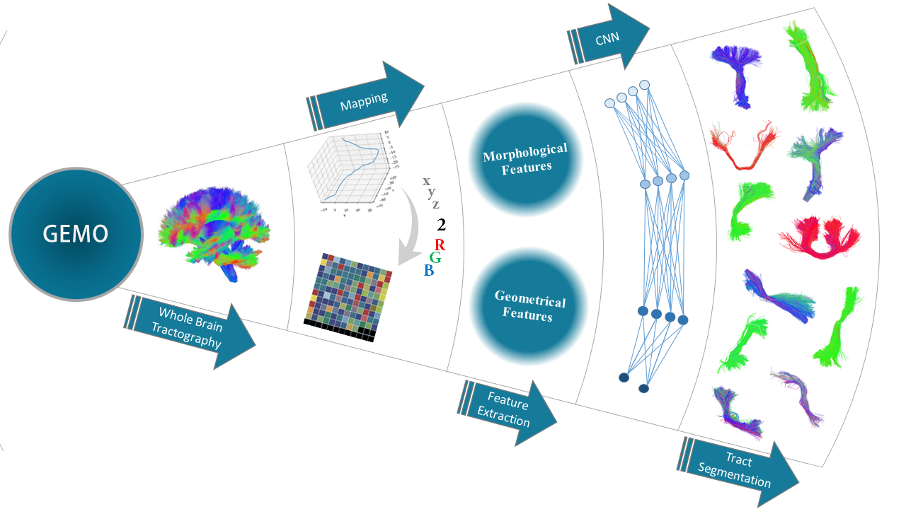
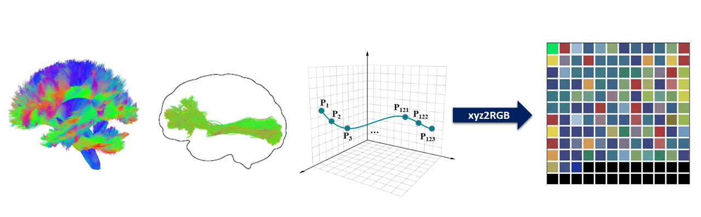

# **GEMO: A deep learning method for brain fiber classification and tract segmentation using geometrical and morphological features**

PyTorch implementation of GEMO, a deep learning framework for white matter streamline classification and tract segmentation using convolutional neural networks together with handcrafted geometric and morphological features.

**Overview**

Diffusion-weighted magnetic resonance imaging (dMRI) is often used to study brain structure. One of the important applications made possible by dMRI is streamline tractography that is utilized for structural connectivity evaluation and neurosurgical planning. GEMO is a supervised deep learning framework for white matter streamline classification that combines convolutional neural network (CNN) features with handcrafted geometric and morphological descriptors to improve classification performance. This approach benefits from GEometrical and MOrphological features in addition to the features extracted from a convolutional neural network for improving the final classification performance. Streamlines are transformed from three-dimensional coordinate space into two-dimensional color-encoded images using the “xyz2RGB” mapping method and are subsequently fed into a convolutional neural network for learning and classification. This method performs the streamline classification from a whole brain tractogram, only focusing on each streamline’s features, which include those provided from CNN in addition to geometric and morphologic features.



**Complete list of output classes in GEMO**

- AF_L — Left Arcuate Fasciculus
- AF_R — Right Arcuate Fasciculus
- CC_Fr_1 — Corpus Callosum, Frontal Region 1
- CC_Fr_2 — Corpus Callosum, Frontal Region 2
- CC_Oc — Corpus Callosum, Occipital Region
- CC_Pa — Corpus Callosum, Parietal Region
- CC_Pr_Po — Corpus Callosum, Precentral/Postcentral Region
- CG_L — Left Cingulum
- CG_R — Right Cingulum
- FAT_L — Left Frontal Aslant Tract
- FAT_R — Right Frontal Aslant Tract
- FPT_L — Left Frontopontine Tract
- FPT_R — Right Frontopontine Tract
- IFOF_L — Left Inferior Fronto-Occipital Fasciculus
- IFOF_R — Right Inferior Fronto-Occipital Fasciculus
- ILF_L — Left Inferior Longitudinal Fasciculus
- ILF_R — Right Inferior Longitudinal Fasciculus
- MCP — Middle Cerebellar Peduncle
- MdLF_L — Left Middle Longitudinal Fasciculus
- MdLF_R — Right Middle Longitudinal Fasciculus
- POPT_L — Left Parieto-Occipital Pontine Tract
- POPT_R — Right Parieto-Occipital Pontine Tract
- PYT_L — Left Pyramidal (Corticospinal) Tract
- PYT_R — Right Pyramidal (Corticospinal) Tract
- SLF_L — Left Superior Longitudinal Fasciculus
- SLF_R — Right Superior Longitudinal Fasciculus
- UF_L — Left Uncinate Fasciculus
- UF_R — Right Uncinate Fasciculus
- OR_ML_L — Left Optic Radiation (Meyer's Loop)
- OR_ML_R — Right Optic Radiation (Meyer's Loop)

    
 
# Installation

Install directly from GitHub:

```bash
pip install git+https://github.com/amin-barati/GEMO.git
```

This requires `git` to be available on your machine.

# Usage: classify a tractogram

```bash
gemo-infer --trk-path wholebrain.trk --output-dir classified_output
```

By default this uses the checkpoint and label map bundled with the package
(`gemo/checkpoints/best.pt`, `gemo/checkpoints/label_map.json`). To use a
different, custom-trained model instead:

```bash
gemo-infer --trk-path wholebrain.trk \
    --checkpoint /path/to/best.pt \
    --label-map /path/to/label_map.json \
    --output-dir classified_output \
    --threshold 0.70
```

This writes one `.trk` file per predicted tract class, plus one
`_Unknown.trk` file for streamlines whose top softmax probability falls
below `--threshold`.


# xyz2RGB

The `xyz2RGB` module converts each streamline of a tractogram into a RGB image by mapping the normalized x, y, and z coordinates to the red, green, and blue color channels, respectively. These images provide a compact representation of streamline geometry and serve as the input to the convolutional neural network (CNN) used in GEMO. The following example converts all streamlines contained in a single `.trk` file into RGB images.




**Generate RGB images from a single tractogram**

An example of how `xyz2RGB` maps each streamline to an RGB image is provided in the following code.

```python
from xyz2RGB_test import trk_to_images

images = trk_to_images("Sample_Tract.trk", output_dir="output_images")
```

**TCK to TRK Conversion**

If your tractogram files are in `.tck` format, convert them to `.trk` format before starting training or inference. The `tck_to_trk.py` utility supports both individual files and entire directories.

Convert a single `.tck` file:
```bash
python tck_to_trk.py --input AF_left.tck --output AF_left.trk
```

Convert all .tck files in a directory:

```bash
python tck_to_trk.py --input "TCK_directory" --output "TRK_directory"
```

# Training on your own data

 After generating the RGB images and extracting the handcrafted features, the model can be trained using the provided training script. During training, the RGB images are processed by a CNN, the handcrafted features are encoded using a multilayer perceptron (MLP), and the learned representations are fused to classify each streamline into its corresponding white matter tract. The command below starts the complete training pipeline.


# Requirements
    python==3.12
    numpy==2.2.6
    scipy==1.16.0
    torch==2.8.0
    torchvision==0.23.0
    nibabel==5.3.2
    h5py==3.14.0
    tqdm==4.67.1
    scikit-learn==1.7.1
    matplotlib==3.10.5

```bash
pip install -r requirements.txt
```

    GEMO/
    ├── train.py
    ├── streamline_model.py
    ├── dataset.py
    ├── streamline_features.py
    ├── xyz2RGB.py
    ├── utils.py
    ├── config.py    
    ├── inference.py    
    ├── requirements.txt
    ├── TRK_directory/
    │   ├── Tract_01.trk
    │   ├── ...
    │   └── Tract_999.trk
    ├── bounds.h5
    └── features.h5

## 1. Precompute subject bounds

 ```python
 from streamline_features import compute_and_save_bounds_metadata
 compute_and_save_bounds_metadata("TRK_directory", "bounds.h5")
 ```


## 2. Extract handcrafted features

**Extract geometric and morphological features**

GEMO utilizes several handcrafted geometric and morphological descriptors for each streamline, including length, curvature, tortuosity, spectral entropy, fractal dimension, and lacunarity. These features are computed once and stored in an HDF5 (`.h5`) file, allowing efficient loading during training without repeated feature computation.

 ```python
from streamline_features import extract_features_from_directory
extract_features_from_directory("TRK_directory", "features.h5", bounds_h5_path="bounds.h5")
 ```
## 3. Train model

 ```bash
 python train.py --trk-dir TRK_directory --features-h5 features.h5 --bounds-h5 bounds.h5
 ```
## 4. Inference

```bash
python inference.py --trk-path wholebrain.trk --checkpoint checkpoints/best.pt --label-map checkpoints/label_map.json --output-dir classified_output --threshold 0.70
```

# Citation
GEMO is the code for the following paper; if you use this repository in your research, please cite:

    GEMO: A deep learning method for brain fiber classification and tract segmentation using geometrical and morphological features
    
    Journal: Academic Radiology
    
    DOI:https://doi.org/10.1016/j.acra.2026.07.024